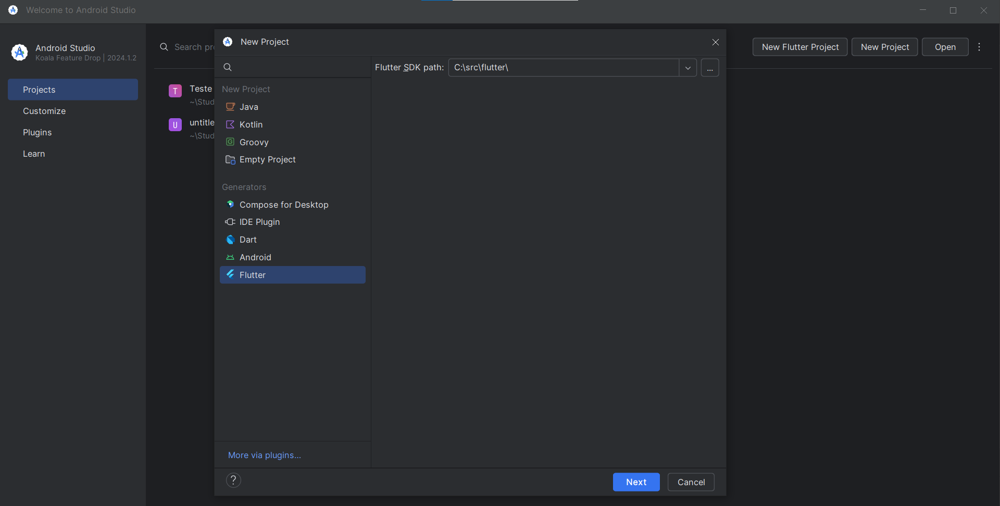
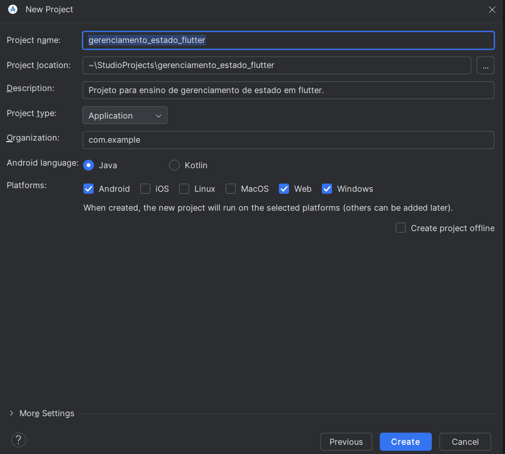
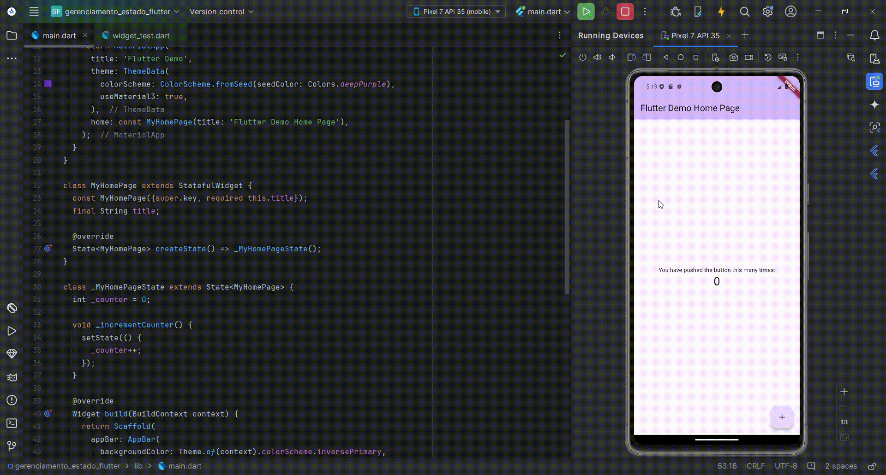

# Tutorial: Gerenciamento de Estado em Flutter

<details>
<summary style="font-size: 20px; font-weight: bold;"> I. Introdução ao Gerenciamento de Estados em Flutter </summary>

O gerenciamento de estado é um conceito crucial em aplicativos Flutter, pois controla como as mudanças de estado (como interações do usuário) afetam a interface do usuário. Este tutorial fornecerá uma visão geral do gerenciamento de estado em Flutter, destacando a importância, os conceitos e algumas abordagens comuns.

## 1. O que é Gerenciamento de Estado?

Gerenciamento de estado refere-se ao **controle do estado** de um ou mais elementos da interface de usuário (UI), como campos de texto, botões, listas, etc. Em termos simples, o estado de um aplicativo é tudo o que pode mudar durante sua execução: valores de variáveis, entradas do usuário, seleções, etc.

O estado em Flutter pode ser algo tão simples quanto um campo de texto sendo preenchido, ou algo mais complexo, como dados de um carrinho de compras sendo atualizados à medida que o usuário adiciona produtos.

---

## 2. Por que o Gerenciamento de Estado é Importante?

O gerenciamento de estado desempenha um papel fundamental em:

- **Manutenção do código**: Um código bem estruturado com um gerenciamento de estado eficiente é mais fácil de ler e manter.
- **Padronização**: Ajuda a seguir boas práticas e convenções.
- **Testes**: Facilita a criação de testes, permitindo simulações de mudanças de estado e seus efeitos na UI.
- **Performance**: Controlar quando e como a UI é redesenhada com base em mudanças no estado evita renderizações desnecessárias, otimizando o desempenho.

---

## 3. Flutter e a Abordagem Declarativa

O Flutter usa um estilo **declarativo** para construir interfaces de usuário (UI). Isso significa que o Flutter redesenha a interface toda vez que o estado do aplicativo muda, para garantir que a UI esteja sempre sincronizada com o estado mais recente.

**Como funciona:**
- Quando o **estado** de um widget muda, o Flutter **reconstrói** automaticamente a UI associada àquele estado.
- **Mudança de estado** ➡️ **Atualização da UI**

---

## 4. Exemplo de Gerenciamento de Estado: MyLoginScreen, MyCatalog e MyCart

Considere um aplicativo simples com as seguintes telas:
- `MyLoginScreen`: Tela de login.
- `MyCatalog`: Tela de catálogo de produtos.
- `MyCart`: Tela do carrinho de compras.

Aqui está como o estado influencia as telas:

- O **estado de CART** se refere aos itens do carrinho, esse valor vai send alterado de acordo com os itens adicionados.
- O **estado de `MyCatalog`** depende do estado de login do usuário (ou seja, o usuário deve estar logado para acessar o catálogo).
- O **estado de `MyCart`** depende dos itens disponíveis no catálogo, ou seja, os produtos adicionados no carrinho são retirados do catálogo.


<div align="center">
  
  <p><em>Fonte: https://docs.flutter.dev/data-and-backend/state-mgmt/intro </em></p>
</div>

---

## 5. Exemplo de Gerenciamento de Estado utilizando o `SetState`

A forma mais simples de gerenciar o estado em Flutter é utilizando o método `setState`, que faz parte da classe `StatefulWidget`. Esse método é responsável por notificar o Flutter que o estado interno de um widget foi alterado, o que resulta em um redesenho da interface.

### Como o `setState` Funciona?

Sempre que o método `setState` é chamado, o Flutter sabe que o estado de um widget mudou e, portanto, precisa reconstruir a parte relevante da interface. Isso é útil para pequenos casos onde o estado é local a um widget e não precisa ser compartilhado com outros componentes.

### `setState` é a Única Forma de Gerenciar Estado?

Não, o uso do setState é uma forma simples de gerenciar o estado, mas tem suas limitações. Ele funciona bem para casos em que o estado afeta apenas um widget ou uma pequena parte da interface. No entanto, em aplicações maiores e mais complexas, o uso de setState pode levar a problemas como:

- Código duplicado: Manter o estado em múltiplos widgets pode resultar em código duplicado, aumentando a dificuldade de manutenção.
- Dificuldade de compartilhamento de estado: Quando o estado precisa ser compartilhado entre várias partes da aplicação, o setState pode não ser eficiente.
- Impacto na performance: Redesenhar grandes partes da interface repetidamente pode causar degradação de desempenho, especialmente quando a lógica de estado se torna mais complexa.

### Alternativas ao `setState`
Para projetos maiores ou que demandam uma arquitetura mais robusta, existem outras soluções de gerenciamento de estado que são mais escaláveis e organizadas:

- **Provider** : Permite compartilhar o estado entre vários widgets de maneira eficiente.
- **Riverpod**: Uma versão aprimorada e mais segura do Provider.
- **Bloc/Cubit**: Uma abordagem baseada em eventos e streams, útil para separar a lógica de negócios da UI.
- **GetX**: Uma abordagem simples e leve para gerenciamento de estado, com recursos integrados de navegação e dependências.

</details>


<details>
<summary style="font-size: 20px; font-weight: bold;"> II. Tutorial Prático de Gerenciamento de Estados em Flutter</summary>

## Sumário
1. [Introdução](#1-introdução)
2. [Pré-requisitos](#2-pré-requisitos)
3. [Passo 1: Criando o Projeto Flutter](#3-criando-o-projeto-flutter)
4. [Implementando o Gerenciamento de Estado com `setState`](#4-implementando-o-gerenciamento-de-estado-com-setstate)
5. [Implementando o Provider para Gerenciamento Global de Estado](#5-implementando-o-provider-para-gerenciamento-global-de-estado)
6. [Conclusão](#6-conclusão)


## 1. Introdução

Neste tutorial, vamos desenvolver uma aplicação Flutter para ensinar o conceito de gerenciamento de estado em Flutter. Vamos começar com o método mais básico, que é o `setState`, e, em seguida, evoluir para uma abordagem mais avançada usando o pacote `Provider`.

O gerenciamento de estado é essencial em Flutter para lidar com a mudança de dados em uma interface. Conforme o aplicativo cresce, utilizar uma abordagem organizada para o estado se torna crucial para a manutenção e performance.

---

## 2. Pré-requisitos

Antes de começar, certifique-se de que você tenha os seguintes itens instalados:

- Flutter SDK ([Instalação do Flutter](https://flutter.dev/docs/get-started/install))
- Editor de código (Recomendado: VS Code ou Android Studio)
- Conhecimentos básicos de Flutter e Dart

---

## 3. Criando o Projeto Flutter

Vamos começar criando um novo projeto Flutter.
Nessa caso, utilizaremos o `Android Studio`.

### 3.1 Criando o Projeto

- Abra o Android Studio e vá em `> New Flutter Project`.  
- Em generator, selecione `Flutter` e clique em Next.
<div align="center">
  
</div>

- Na próxima tela, você terá a opção de configurar o nome do projeto, o diretório onde ele será salvo, além de configurar a descrição do projeto, linguagens de programação e plataformas suportadas. Configure de acordo com suas preferências.
- Para fins de padronização neste tutorial, vamos usar as configurações descritas na imagem abaixo.
- Após definir todas as configurações, clique em `Create` para finalizar a criação do projeto.

<div align="center">
  
</div>

- #### Agora que o projeto foi criado, você verá a estrutura de pastas no Android Studio com o código básico do Flutter já gerado.

---

## 4. Implementando o Gerenciamento de Estado com `setState`

Agora que o projeto foi criado, vamos implementar o gerenciamento de estado usando o método `setState`. 

O método `setState` é utilizado para atualizar a interface do usuário sempre que o estado de um componente mudar.

### 4.1 Criando a Interface Simples

Abra o arquivo `lib/main.dart`:

``` dart
import 'package:flutter/material.dart';

void main() {
  runApp(const MyApp());
}

class MyApp extends StatelessWidget {
  const MyApp({super.key});
  @override
  Widget build(BuildContext context) {
    return MaterialApp(
      title: 'Flutter Demo',
      theme: ThemeData(
        colorScheme: ColorScheme.fromSeed(seedColor: Colors.deepPurple),
        useMaterial3: true,
      ),
      home: const MyHomePage(title: 'Flutter Demo Home Page'),
    );
  }
}

class MyHomePage extends StatefulWidget {
  const MyHomePage({super.key, required this.title});
  final String title;

  @override
  State<MyHomePage> createState() => _MyHomePageState();
}

class _MyHomePageState extends State<MyHomePage> {
  int _counter = 0;

  void _incrementCounter() {
    setState(() {
      _counter++;
    });
  }

  @override
  Widget build(BuildContext context) {
    return Scaffold(
      appBar: AppBar(
        backgroundColor: Theme.of(context).colorScheme.inversePrimary,
        title: Text(widget.title),
      ),
      body: Center(
        child: Column(
          mainAxisAlignment: MainAxisAlignment.center,
          children: <Widget>[
            const Text(
              'You have pushed the button this many times:',
            ),
            Text(
              '$_counter',
              style: Theme.of(context).textTheme.headlineMedium,
            ),
          ],
        ),
      ),
      floatingActionButton: FloatingActionButton(
        onPressed: _incrementCounter,
        tooltip: 'Increment',
        child: const Icon(Icons.add),
      ),
    );
  }
}


```

<div align="center">
  
</div>

O código acima é o código padrão gerado pelo Flutter ao criar um novo projeto, mas também serve como um excelente exemplo para explicar o uso do `setState no gerenciamento de estado` local.

### O Papel da Função build() no Flutter
A função `build()` é responsável por descrever como a interface do usuário deve parecer naquele momento, com base no estado atual do widget. Ela é parte de todo widget Stateful ou Stateless no Flutter.
A função build() é chamada toda vez que há uma mudança no estado. Isso permite ao Flutter saber exatamente como a interface deve parecer naquele momento.

**Como Funciona:**
Quando o Flutter detecta uma mudança no estado (por exemplo, quando o usuário interage com um botão ou campo de texto), ele chama novamente a função `build()` para reconstruir a interface.

Essa reconstrução acontece porque, na abordagem declarativa, você não altera diretamente elementos da interface. Em vez disso, você muda o estado, e o Flutter automaticamente chama build() para reconstruir a árvore de widgets, refletindo as mudanças visuais necessárias.

### 4.2 Como o `setState` é usado nesse exemplo:
**Variável de Estado (_counter):**
A variável _counter dentro da classe _MyHomePageState é usada para armazenar o número de vezes que o botão foi pressionado. Ela representa o estado da aplicação.

**Função _incrementCounter():**
A função _incrementCounter usa o método setState para atualizar o valor da variável _counter. O método setState notifica o Flutter de que o estado mudou, resultando na reconstrução da UI com o novo valor de _counter.

**Atualização da Interface:**
Após a chamada de setState, o Flutter reconstrói os widgets que dependem da variável _counter. Nesse caso, a interface exibe o novo valor do contador no widget Text:

## 5. Implementando o Provider para Gerenciamento Global de Estado
Embora o setState funcione bem para pequenos aplicativos, ele não é ideal para aplicações maiores. Agora, vamos implementar o Provider, que oferece uma abordagem mais escalável e organizada para o gerenciamento de estado.

O Provider é uma biblioteca que permite compartilhar o estado entre diferentes partes da interface do aplicativo sem precisar passar dados manualmente de um widget para outro.

#### 5.1 Adicionando o Provider ao Projeto
No terminal, dentro do diretório do seu projeto Flutter, execute o seguinte comando para adicionar o pacote provider:
```
flutter pub add provider
```
Ou adicione a dependência do provider na pasta `pubspec.yaml`:

 ```
dependencies:
  flutter:
    sdk: flutter
  provider: ^6.0.0  
```

#### 5.2 Criando uma Interface Simples
Agora iremos implementar a mesma aplicação do passo 4, mas utilizando o provider para gerenciamento de estado.

Primeiramente crie a classe `counter.dart` e insira o código abaixo:
``` dart
import 'package:flutter/material.dart';

class Counter with ChangeNotifier {
  int _count = 0;

  int get count => _count;

  void increment() {
    _count++;
    notifyListeners();
  }
}
```
A classe `counter.dart` é uma classe simples que mantém o estado do contador (_count) e possui um método increment para aumentar o valor. O notifyListeners() notifica os widgets quando o valor muda.

No arquivo `main.dart` podemos substituir o código atual pelo código abaixo:
```dart
import 'package:flutter/material.dart';
import 'package:provider/provider.dart';
import 'counter.dart'; // Importe a classe do contador

void main() {
  runApp(
    ChangeNotifierProvider(
      create: (_) => Counter(),
      child: MyApp(),
    ),
  );
}

class MyApp extends StatelessWidget {
  @override
  Widget build(BuildContext context) {
    return MaterialApp(
      home: CounterScreen(),
    );
  }
}

class CounterScreen extends StatelessWidget {
  @override
  Widget build(BuildContext context) {
    return Scaffold(
      appBar: AppBar(title: Text('Contador Simples')),
      body: Center(
        child: Column(
          mainAxisAlignment: MainAxisAlignment.center,
          children: [
            Text('Valor do contador:'),
            // Exibindo o valor do contador
            Text(
              '${context.watch<Counter>().count}',
              style: TextStyle(fontSize: 40),
            ),
          ],
        ),
      ),
      floatingActionButton: FloatingActionButton(
        onPressed: () {
          context.read<Counter>().increment(); // Incrementa o contador
        },
        child: Icon(Icons.add),
      ),
    );
  }
}
```

O provider no código acima tem a função de gerenciar e compartilhar o estado de uma forma organizada e eficiente. No nosso exemplo, o `estado é o valor do contador`, que começa em 0 e é incrementado cada vez que o botão é pressionado.

**ChangeNotifierProvider:**
Este é o componente chave. Ele envolve a árvore de widgets (no caso, o MyApp) e fornece uma instância da classe Counter (modelo de estado).
Isso significa que qualquer widget dentro do MyApp pode acessar o estado do contador e ser notificado quando ele mudar.

**context.watch<Counter>():**
Esse método permite que um widget escute as mudanças no estado do contador.
No código, usamos isso para exibir o valor do contador. Quando o contador mudar (por exemplo, quando o botão de incremento for pressionado), esse widget será atualizado automaticamente.

**context.read<Counter>().increment():**
O método read permite acessar o estado, mas sem escutar suas mudanças. Usamos isso quando queremos executar uma ação, como incrementar o contador.
No exemplo, quando o botão de incremento é pressionado, o read chama o método increment() do Counter, que aumenta o valor do contador e notifica os widgets que estão escutando.

**notifyListeners():**
Dentro da classe Counter, sempre que o valor do contador muda, chamamos notifyListeners(). Isso faz com que todos os widgets que estão escutando o estado (através do watch) sejam notificados e atualizados.

Dessa forma, o provider organiza o código, evitando que você precise passar manualmente o estado de widget para widget.

## 6. Conclusão
Neste tutorial, abordamos duas formas de gerenciamento de estado no Flutter: o uso de `setState` para atualizações locais e o uso de `Provider` para um gerenciamento global de estado. O Provider é uma abordagem mais adequada para projetos maiores, onde o estado precisa ser compartilhado entre vários widgets.


</details>
