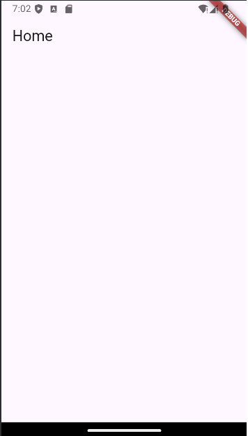

# Tutorial 3 – Widgets no Flutter

Este tutorial tem o intuito de explicar e demonstrar de forma clara e objetiva a construção visual (Interface) no Flutter, que é formado por **Widgets**.

Um **Widget** gera uma parte da interface do usuário (UI) do aplicativo, como um texto, uma imagem ou um botão. Eles são criados a partir de outros Widgets.

## StatelessWidget e StatefulWidget

Os dois tipos principais de Widgets no Flutter são o **StatelessWidget** e o **StatefulWidget**, que diferem na forma como lidam com o estado.

### StatelessWidget

O **StatelessWidget** tem um estado fixo, ou seja, suas características não mudam desde o início da aplicação. Um exemplo de **StatelessWidget** seria:

```dart
import 'package:flutter/material.dart';

void main() => runApp(const MeuApp());

class MeuApp extends StatelessWidget {
  const MeuApp({Key? key}) : super(key: key);

  @override
  Widget build(BuildContext context) {
    return MaterialApp(
      home: Scaffold(
        appBar: AppBar(
          title: const Text('Home'),
        ), // AppBar
      ), // Scaffold
    ); // MaterialApp
  }
}
```
<div style="text-align: center;">  <p><em>Figura 1: Exemplo de StatelessWidget com um AppBar na interface inicial.</em></p> </div> 

# StatefulWidget: Estado Mutável no Flutter

O **StatefulWidget** tem um estado mutável, o que significa que suas características podem ser alteradas durante a execução do aplicativo. Um exemplo clássico é quando, ao apertar um botão, um número ou uma palavra é alterado. Neste exemplo, qualquer widget pode mudar dinamicamente:

```dart
import 'package:flutter/material.dart';

void main() {
  runApp(const MaterialApp(
    home: MyButton(),
  )); // MaterialApp
}

class MyButton extends StatefulWidget {
  const MyButton({Key? key}) : super(key: key);

  @override
  MyButtonState createState() {
    return MyButtonState();
  }
}

class MyButtonState extends State<MyButton> {
  int counter = 0;
  List<String> strings = ['Flutter', 'é', 'legal', 'e', 'incrível.'];
  String displayedString = "Olá Mundo!";

  void onPressOfButton() {
    setState(() {
      displayedString = strings[counter];
      counter = counter < 4 ? counter + 1 : 0;
    });
  }

  @override
  Widget build(BuildContext context) {
    return Scaffold(
      appBar: AppBar(
        title: const Text("Exemplo com StatefulWidget"),
        backgroundColor: Colors.green,
      ), // AppBar
      body: Center(
        child: Column(
          mainAxisAlignment: MainAxisAlignment.center,
          children: <Widget>[
            Text(displayedString, style: const TextStyle(fontSize: 40.0)),
            const Padding(padding: EdgeInsets.all(10.0)),
            ElevatedButton(
              child: const Text(
                "Clique aqui",
                style: TextStyle(color: Colors.white),
              ), // Text
              style: ElevatedButton.styleFrom(primary: Colors.red),
              onPressed: onPressOfButton,
            ), // ElevatedButton
          ], // <Widget>[]
        ), // Column
      ), // Center
    ); // Scaffold
  }
}
```
<div style="text-align: center;">  <p><em>Figura 1: Esse é um exemplo de uma aplicação que ao apertar o botão as palavras mudam. Perfeito exemplo de StateFullWidget.</em></p> </div>


# Layouts no Flutter (Row, Column, Stack)

## Row

- Alinha os Widgets horizontalmente (um ao lado do outro).
- Útil quando você quer colocar elementos como ícones e textos em uma linha.

### Exemplo:
```dart
Row(
  children: [
    Icon(Icons.star),
    Text('Favorito'),
  ],
)
```
Neste exemplo, o ícone de estrela será exibido à esquerda e o texto "Favorito" ao lado dele, horizontalmente.

## Column

- Alinha os widgets verticalmente (um embaixo do outro).
- Ideal para listas de elementos como botões ou textos.

### Exemplo:
```dart
Column(
  children: [
    Text('Título'),
    Text('Subtítulo'),
  ],
)
```
Neste exemplo, o ícone de estrela será exibido à esquerda e o texto "Favorito" ao lado dele, horizontalmente.

## Column

- Alinha os widgets verticalmente (um embaixo do outro).
- Ideal para listas de elementos como botões ou textos.

### Exemplo:
```dart
Column(
  children: [
    Text('Título'),
    Text('Subtítulo'),
  ],
)
```
Aqui, o texto "Título" aparece no topo e "Subtítulo" logo abaixo dele.

## Stack

- Permite sobrepor widgets uns sobre os outros.
- Útil para criar elementos que ficam sobrepostos, como imagens com textos por cima.

### Exemplo:
```dart
Stack(
  children: [
    Image.network('https://via.placeholder.com/150'),
    Positioned(
      bottom: 10,
      right: 10,
      child: Text('Legenda'),
    ),
  ],
)
```
Este exemplo coloca um texto ("Legenda") sobre a imagem, posicionando-o no canto inferior direito.

## Resumo Rápido:

- **Row**: Alinhamento horizontal.
- **Column**: Alinhamento vertical.
- **Stack**: Widgets sobrepostos.

## Navigator

No Flutter, o Navigator é usado para gerenciar a navegação entre telas (ou páginas). Ele funciona como uma pilha (stack), onde as páginas são empilhadas umas sobre as outras, e você pode empurrar (push) uma nova página ou retirar (pop) a página atual da pilha.

### Navegação básica com Navigator:

1. **Push**: Adiciona uma nova página à pilha.
2. **Pop**: Remove a página atual da pilha e retorna para a anterior.

### Exemplo simples de navegação:

#### Página Inicial:

```dart
import 'package:flutter/material.dart';

void main() {
  runApp(MaterialApp(
    home: PrimeiraPagina(),
  ));
}

class PrimeiraPagina extends StatelessWidget {
  @override
  Widget build(BuildContext context) {
    return Scaffold(
      appBar: AppBar(
        title: Text('Primeira Página'),
      ),
      body: Center(
        child: ElevatedButton(
          onPressed: () {
            // Navega para a Segunda Página
            Navigator.push(
              context,
              MaterialPageRoute(builder: (context) => SegundaPagina()),
            );
          },
          child: Text('Ir para a Segunda Página'),
        ),
      ),
    );
  }
}
class SegundaPagina extends StatelessWidget {
  @override
  Widget build(BuildContext context) {
    return Scaffold(
      appBar: AppBar(
        title: Text('Segunda Página'),
      ),
      body: Center(
        child: ElevatedButton(
          onPressed: () {
            // Volta para a Primeira Página
            Navigator.pop(context);
          },
          child: Text('Voltar para a Primeira Página'),
        ),
      ),
    );
  }
}
```
## Explicação:

1. Na **Primeira Página**, ao clicar no botão, a função `Navigator.push` é chamada. Ela navega para a **Segunda Página**, empurrando a nova página na pilha.
2. Na **Segunda Página**, o botão usa `Navigator.pop` para retornar à página anterior, removendo a segunda página da pilha.

## Navegação com dados:

Você também pode passar dados entre as páginas. Veja o exemplo de como passar e retornar dados:

### Passando dados para a segunda página:

```dart
Navigator.push(
  context,
  MaterialPageRoute(
    builder: (context) => SegundaPagina(mensagem: 'Olá!'),
  ),
);

class SegundaPagina extends StatelessWidget {
  final String mensagem;
  
  SegundaPagina({required this.mensagem});
  
  @override
  Widget build(BuildContext context) {
    return Scaffold(
      appBar: AppBar(
        title: Text('Segunda Página'),
      ),
      body: Center(
        child: Text(mensagem), // Exibe a mensagem recebida
      ),
    );
  }
}
```
## Resumo:

- **Navigator.push**: Navega para uma nova página, empilhando-a.
- **Navigator.pop**: Retorna para a página anterior, removendo a página atual da pilha.
- Pode-se passar dados entre páginas e retornar valores.
## Formulários e Validação

No Flutter, você pode criar formulários usando o widget **Form**, que permite organizar campos de entrada e aplicar validação para garantir que os dados inseridos estão corretos. O widget **Form** funciona em conjunto com **TextFormField** e um **GlobalKey** para controlar o estado do formulário e realizar validações.

### Passos básicos para criar um formulário com validação:

1. Definir o formulário usando o widget **Form**.
2. Usar **TextFormField** para os campos de entrada.
3. Aplicar validações usando o parâmetro **validator** do **TextFormField**.
4. Controlar o estado do formulário usando um **GlobalKey**.

### Exemplo Simples de Formulário com Validação

```dart
import 'package:flutter/material.dart';

void main() {
  runApp(MaterialApp(
    home: FormularioExemplo(),
  ));
}

class FormularioExemplo extends StatefulWidget {
  @override
  _FormularioExemploState createState() => _FormularioExemploState();
}

class _FormularioExemploState extends State<FormularioExemplo> {
  // Chave global para identificar o estado do formulário
  final _formKey = GlobalKey<FormState>();

  // Controladores de texto para pegar os valores
  final TextEditingController _nomeController = TextEditingController();
  final TextEditingController _emailController = TextEditingController();

  @override
  Widget build(BuildContext context) {
    return Scaffold(
      appBar: AppBar(
        title: Text('Formulário com Validação'),
      ),
      body: Padding(
        padding: const EdgeInsets.all(16.0),
        child: Form(
          // Atribui a chave do formulário
          key: _formKey,
          child: Column(
            children: [
              // Campo de Nome
              TextFormField(
                controller: _nomeController,
                decoration: InputDecoration(labelText: 'Nome'),
                validator: (value) {
                  if (value == null || value.isEmpty) {
                    return 'Por favor, insira o seu nome';
                  }
                  return null; // Se estiver correto, não retorna erro
                },
              ),
              SizedBox(height: 16),
              // Campo de Email
              TextFormField(
                controller: _emailController,
                decoration: InputDecoration(labelText: 'Email'),
                validator: (value) {
                  if (value == null || value.isEmpty) {
                    return 'Por favor, insira o seu email';
                  } else if (!RegExp(r'^[^@]+@[^@]+\.[^@]+').hasMatch(value)) {
                    return 'Por favor, insira um email válido';
                  }
                  return null;
                },
              ),
              SizedBox(height: 20),
              // Botão de Enviar
              ElevatedButton(
                onPressed: () {
                  // Verifica se todos os campos são válidos
                  if (_formKey.currentState!.validate()) {
                    // Se forem válidos, exibe uma mensagem
                    ScaffoldMessenger.of(context).showSnackBar(
                      SnackBar(content: Text('Formulário válido!')),
                    );
                  }
                },
                child: Text('Enviar'),
              ),
            ],
          ),
        ),
      ),
    );
  }
}
```
## Explicação

1. **Form**: O formulário envolve os campos de texto e o botão. Ele usa uma **GlobalKey** para acessar e validar seu estado.
  
2. **TextFormField**: Cada campo de entrada tem um **validator** que verifica se o valor é válido.
   - O campo **Nome** deve ser preenchido.
   - O campo **Email** valida se o formato está correto com uma expressão regular.
  
3. **_formKey**: A chave global é usada para verificar o estado do formulário e chamar o método **validate()** para verificar se todos os campos são válidos.

4. **SnackBar**: Exibe uma mensagem quando o formulário é validado com sucesso.

### Validações mais comuns:
- Verificar se o campo está vazio.
- Validar formato de email, números, etc.
- Verificar a quantidade mínima ou máxima de caracteres.

## Resumo:
- **Form** e **TextFormField** são usados para criar formulários.
- O **validator** permite adicionar regras de validação personalizadas.
- O método **validate()** é usado para verificar se todos os campos estão corretos antes de continuar com ações como enviar dados ou salvar informações.
